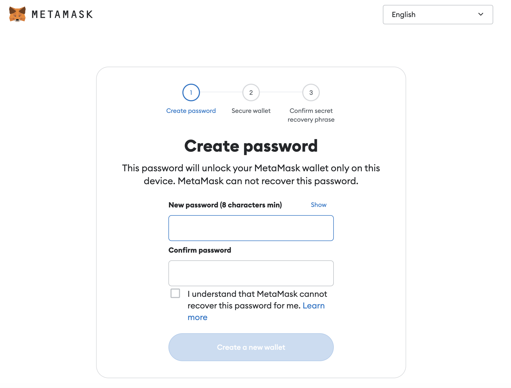

This project was bootstrapped with [Create React App](https://github.com/facebook/create-react-app).

Before running the available scripts, please run `npm install` to install all the dependecies

## Available Scripts

In the project directory, you can run:

### `npm start`

Runs the app in the development mode.\
Open [http://localhost:5555](http://localhost:5555) to view it in your browser.

The page will reload when you make changes.\
You may also see any lint errors in the console.

### `npm test`

Launches the test runner in the interactive watch mode.\
See the section about [running tests](https://facebook.github.io/create-react-app/docs/running-tests) for more information.

### `npm run build`

Builds the app for production to the `build` folder.\
It correctly bundles React in production mode and optimizes the build for the best performance.

The build is minified and the filenames include the hashes.\
Your app is ready to be deployed!

See the section about [deployment](https://facebook.github.io/create-react-app/docs/deployment) for more information.

## Deployment

### Build docker image

`docker build -t r-market-front-end .`

### Run docker image

`docker run -it --rm -v ${PWD}:/app -v /app/node_modules -p 5555:5555 -e CHOKIDAR_USEPOLLING=true r-market-front-end`

### Run docker compose service

`docker compose up -d`

## Usage

Usage of R-MARKET UI is divided into two main stages: (i) Creation of a contract with a resource and (ii) the return of the IP address of said resource. 
These two steps are managed by two different tabs: (1) "Resource", which manages the discovery of resources as well as the creation of contracts and (ii) "My Contracts", which allows to list all the contracts created by the user in a table and retrieve their status (in progress, completed or failed) as well as the result of the execution (IP address of the resource).

Note that in order to use the R-MARKET UI, you can either deploy it on your local network following the instructions aforementioned or [click here](https://datacloud-market.euprojects.net/)  (Note: If you use our deployed R-MARKET-UI by clicking on the provided [link](https://datacloud-market.euprojects.net/), please allow mixed-content (https/http compatibility) in your browser, you can follow this [tutorial](https://experienceleague.adobe.com/docs/target/using/experiences/vec/troubleshoot-composer/mixed-content.html?lang=en) to do so)  to open it in your browser (preferrably [Chrome](https://www.google.com/chrome/?brand=YTUH&gclid=CjwKCAiA_6yfBhBNEiwAkmXy53jfoxDzP_N3zeTX5-toqRBYReB03DTQMtD684N-S1-w0e_nKJ_kLhoCg34QAvD_BwE&gclsrc=aw.ds)). The following of the document explains how to use R-MARKET-UI to:

1. Find resources available on the market
2. Choose a particular resource and create a contract with it
3. See the contracts made with the different resources
4. Return the IP address of a resource concerned by a contract

The R-MARKET tool uses the blockchain technology to create contracts between *workers* (resources) and *requesters* (you). In this context, you will have to send transactions via R-MARKET-UI and sign them using [metamask](https://metamask.io). 
Therefore, in order to use R-MARKET-UI, you will first need to install [metamask](https://metamask.io) and configure it by following the instructions below:

### Metamask configuration

The configuration of metamask follows a few steps:
1. Create an account. 

       
   
       
   
       
   
       
   
       
   
       
   
       
   
       
   
       
   
       
   
       
   
2. Configure the blockchain network to be used.

       
   
       
   
       
   
       
   
3. Connect your metamask account to R-MARKET-UI (a pop-up notification will appear when you load the web app or click on any button)

       
   
       

### Find Resources

1. Upload a JSON file containing your requirements in the desired format (as shown in the example) of use/customize the provided example. 

       
   
2. Click on "Find Resources" to display the available resources in a table. 

       
   
3. Select one of the available resources by clicking on "Create contract" in the corresponding row. Metamask notifications will pop up asking you to sign transactions.

       
   
       
   
       
   
       
   
4. One last Metamask notification will pop up asking you to sign a contract with the selected resource.
   
       
   
5. Contract creation could take some time but an alert eventually pops up notifying you of the creation of the contract with its ID (which you can find in the "My Contracts" tab).
   
       

### Retrieve the result of a contract execution

1. Click on "Get My Contracts" to display the contracts of the user (selected in metamask). 

       
   
       
   
2. Select one of your contracts by clicking on "Select", you should see its ID appearing in the corresponding text area and "Get Status" button should be enabled.

       
   
3. Click on "Get status" to fetch its status, you should see the information in the corresponding text are (in progress in this case).
 
       
   
4. When the task fails or completes, its status changes automatically.
   
       
   
5. If the status is "completed", the "Get Result" button should be enabled. Click on "Get Result" to fetch the result of the contract, you should see the information in the corresponding text are (in progress in this case).
   
       